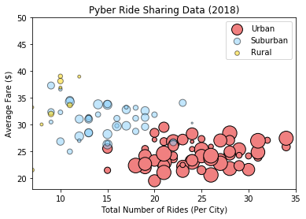
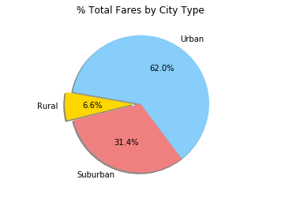
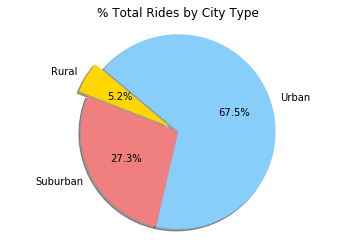
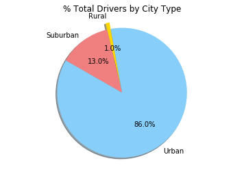

```python
# Import Dependencies
import matplotlib.pyplot as plt
import numpy as np
import pandas as pd
```


```python
city_df = pd.read_csv("city_data.csv")
ride_df = pd.read_csv("ride_data.csv")
combined_df = pd.merge(city_df, ride_df, how='outer', on='city')
combined_df.head()
```


<div>
<style scoped>
    .dataframe tbody tr th:only-of-type {
        vertical-align: middle;
    }

    .dataframe tbody tr th {
        vertical-align: top;
    }

    .dataframe thead th {
        text-align: right;
    }
</style>
<table border="1" class="dataframe">
  <thead>
    <tr style="text-align: right;">
      <th></th>
      <th>city</th>
      <th>driver_count</th>
      <th>type</th>
      <th>date</th>
      <th>fare</th>
      <th>ride_id</th>
    </tr>
  </thead>
  <tbody>
    <tr>
      <th>0</th>
      <td>Kelseyland</td>
      <td>63</td>
      <td>Urban</td>
      <td>2016-08-19 04:27:52</td>
      <td>5.51</td>
      <td>6246006544795</td>
    </tr>
    <tr>
      <th>1</th>
      <td>Kelseyland</td>
      <td>63</td>
      <td>Urban</td>
      <td>2016-04-17 06:59:50</td>
      <td>5.54</td>
      <td>7466473222333</td>
    </tr>
    <tr>
      <th>2</th>
      <td>Kelseyland</td>
      <td>63</td>
      <td>Urban</td>
      <td>2016-05-04 15:06:07</td>
      <td>30.54</td>
      <td>2140501382736</td>
    </tr>
    <tr>
      <th>3</th>
      <td>Kelseyland</td>
      <td>63</td>
      <td>Urban</td>
      <td>2016-01-25 20:44:56</td>
      <td>12.08</td>
      <td>1896987891309</td>
    </tr>
    <tr>
      <th>4</th>
      <td>Kelseyland</td>
      <td>63</td>
      <td>Urban</td>
      <td>2016-08-09 18:19:47</td>
      <td>17.91</td>
      <td>8784212854829</td>
    </tr>
  </tbody>
</table>
</div>


```python
#filtering by region
urban_data = combined_df[combined_df["type"] == "Urban"]
suburban_data = combined_df[combined_df["type"] == "Suburban"]
rural_data = combined_df[combined_df["type"] == "Rural"]

#plotting urban
urban_avg_fares = urban_data.groupby("city")["fare"].mean()
urban_total_rides = urban_data.groupby("city")["ride_id"].count()
urban_total_drivers= urban_data.groupby("city")["driver_count"].sum()/urban_total_rides
plt.scatter(urban_total_rides, 
            urban_avg_fares, 
            s = 5*urban_total_drivers, 
            marker = "o" , 
            facecolors = "lightcoral", 
            edgecolors = "black", 
            alpha=1)

#plotting suburban
suburban_avg_fares = suburban_data.groupby("city")["fare"].mean()
suburban_total_rides = suburban_data.groupby("city")["ride_id"].count()
suburban_total_drivers= suburban_data.groupby("city")["driver_count"].sum()/suburban_total_rides
plt.scatter(suburban_total_rides, 
            suburban_avg_fares, 
            s = 5*suburban_total_drivers, 
            marker = "o" , 
            facecolors = "lightskyblue", 
            edgecolors = "black", 
            alpha=0.5
           )

#plotting rural
rural_avg_fares = rural_data.groupby("city")["fare"].mean()
rural_total_rides = rural_data.groupby("city")["ride_id"].count()
rural_total_drivers= rural_data.groupby("city")["driver_count"].sum()/rural_total_rides
plt.scatter(rural_total_rides, 
            rural_avg_fares, 
            s = 5*rural_total_drivers, 
            marker = "o" , 
            facecolors = "gold", 
            edgecolors = "black",
            alpha = 0.5)

#chart formatting
plt.xlabel("Total Number of Rides (Per City)")
plt.ylabel("Average Fare ($)")
plt.title("Pyber Ride Sharing Data (2018)")
plt.legend(['Urban', 'Suburban', 'Rural'])
plt.xlim(7, 35)
plt.ylim(18, 50)
plt.show()

```





```python
# Labels for the sections of our pie chart
labels = ["Rural", "Suburban", "Urban"]

# Make groups and sum
fare_groups = combined_df.groupby(['type'])
sum_fares = fare_groups['fare'].sum()

# Values per Label
sizes = [sum_fares[hannah] for hannah in sum_fares.keys()]

# Formatting
colors = ["gold", "lightcoral", "lightskyblue"]
explode = (0.1, 0, 0)
plt.axis("equal")

# Labels
plt.title("% Total Fares by City Type")

# Creates the pie chart based upon the values above
plt.pie(sizes, explode=explode, labels=labels, colors=colors, autopct="%1.1f%%", shadow=True, startangle=170)

# Prints our pie chart to the screen
plt.show()
```





```python
# Labels for the sections of our pie chart
labels = ["Rural", "Suburban", "Urban"]

# Make groups and sum
ride_groups = combined_df.groupby(['type'])
sum_rides = ride_groups['ride_id'].count()

# Values per Label
sizes = [sum_rides[hannah] for hannah in sum_rides.keys()]
         
# Formatting
colors = ["gold", "lightcoral", "lightskyblue"]
explode = (0.1, 0, 0)
plt.title("% Total Rides by City Type")

# Automatically finds the percentages of each part of the pie chart
plt.pie(sizes, explode=explode, labels=labels, colors=colors, autopct="%1.1f%%", shadow=True, startangle=140)
plt.axis("equal")
plt.show()
```





```python
#labels for pie chart
labels = ["Rural", "Suburban", "Urban"]

# Make groups and sum
driver_groups = combined_df.groupby(['type'])
sum_drivers = driver_groups['driver_count'].sum()

# Values per Label
sizes = [sum_drivers[hannah] for hannah in sum_drivers.keys()]

# Formatting
colors = ["gold", "lightcoral", "lightskyblue"]
explode = (0.1, 0, 0)
plt.title("% Total Drivers by City Type")

# Automatically finds the percentages of each part of the pie chart
plt.pie(sizes, explode=explode, labels=labels, colors=colors, autopct="%1.1f%%", shadow=True, startangle=100)
plt.axis("equal")
plt.show()
```




